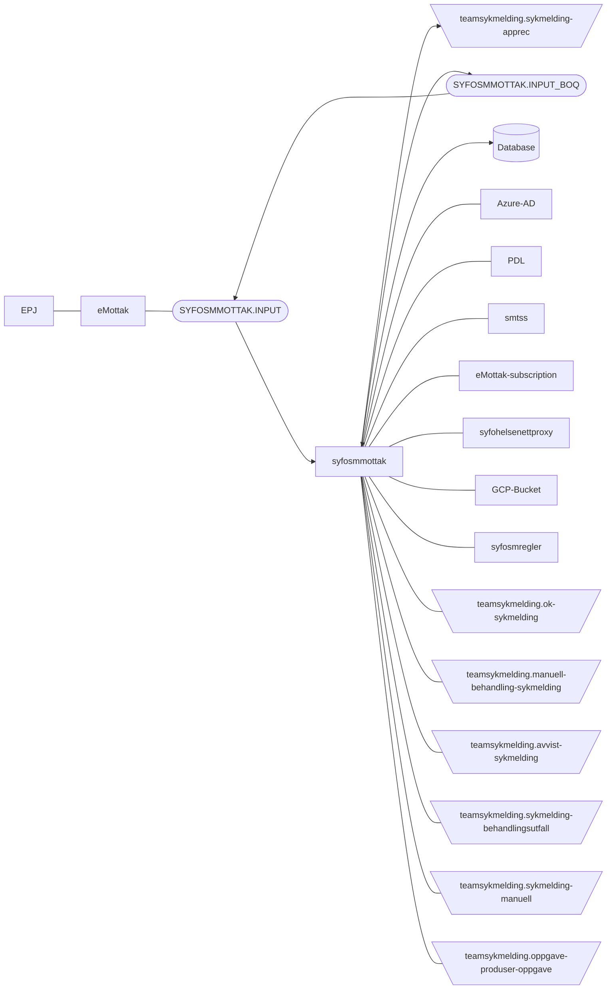

[](https://github.com/navikt/syfosmmottak/workflows/Deploy%20to%20dev%20and%20prod/badge.svg)
# SYFOsmmottak
This project contains just the receiving part of a sykmelding2013 message

## Technologies used
* Kotlin
* Ktor
* Gradle
* Junit
* Jackson
* MQ
* Kafka

### Prerequisites
* JDK 21

Make sure you have the Java JDK 21 installed
You can check which version you have installed using this command:
``` bash
java -version
```

## FlowChart
This the high level flow of the application


#### Running locally
``` bash
./gradlew run
```

### Building the application
#### Compile and package application
To build locally and run the integration tests you can simply run
``` bash
./gradlew shadowJar
```
 or  on windows 
`gradlew.bat shadowJar`

### Upgrading the gradle wrapper
Find the newest version of gradle here: https://gradle.org/releases/ Then run this command:

``` bash
./gradlew wrapper --gradle-version $gradleVersjon
```

### Contact
This project is maintained by [navikt/teamsykmelding](CODEOWNERS)

Questions and/or feature requests? 
Please create an [issue](https://github.com/navikt/syfosmmottak/issues)

If you work in [@navikt](https://github.com/navikt) you can reach us at the Slack
channel [#team-sykmelding](https://nav-it.slack.com/archives/CMA3XV997)
